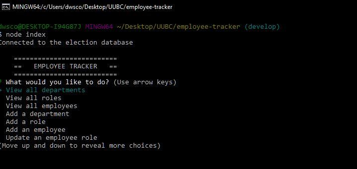
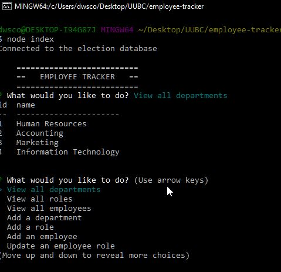
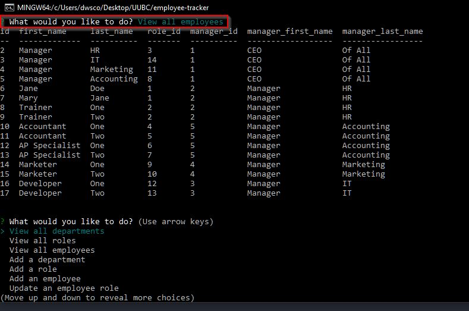
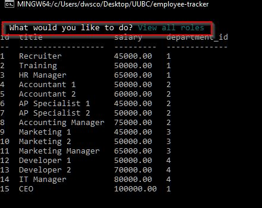
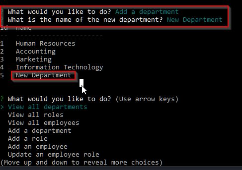
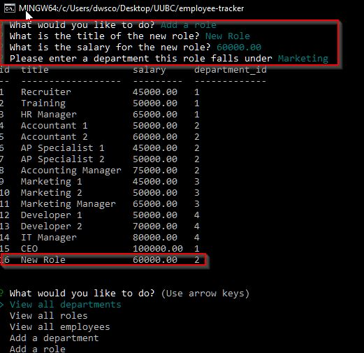
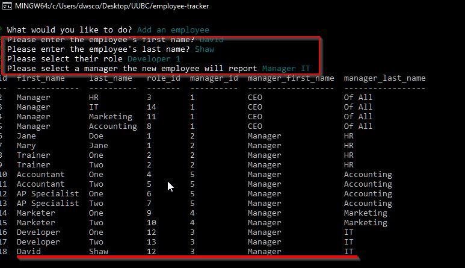
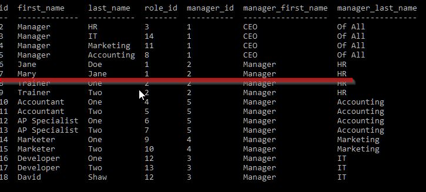
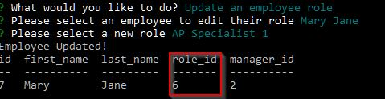

  # Employee Tracker  

  ## About/Description

  This project tracks employees through command line prompts.  It allows the user to view the departments, employees, and job roles.  All of this is stored on a MySQL database so it also allows the user to add a new department, role, or employee and update the role of an existing employee.  It does this through the use of Inquirer prompts and displays the data using Console.Table back.  Node.js allows all of this to function through the command line.

  ## Table of Contents

  * [Installation](#installation)
  * [Usage](#usage)
  * [Languages](#languages)
  * [Contributing](#contributing)
  * [License](#license)
  * [Tests](#tests)
  * [Questions](#questions)
  
  ## Installation

  npm install will download all of the required items from the package.json

  ## Usage
  
  node index from bash will run the program

  ### Video Link Demonstrating the Project

  https://drive.google.com/file/d/18QScuhdK2H85EvnB2LleZs8vN8Dm6Ink/view 

  #### Screenshots

  ##### Page Open

  

  ##### Query All Departments

  

  ##### Query All Employees

  

  ##### Query All Roles

  

  ##### Add A New Department

  

  ##### Add A New Role

  

  ##### Add A New Employee

  

  ##### Update An Employee Role

  ###### Old Role

  

  ###### New Role

  

  ## Languages

  JavaScript ES6 jQuery MySQL Node.js 

  ## Contributing

  Contributions by: David Shaw

  If you would like to contribute to this project we follow the [Contributor Covenant](https://www.contributor-covenant.org/)

  ## License

  https://choosealicense.com/licenses/mit/

  ## Tests

  none

  ## Questions:

  If you have any questions please contact us or refer to our github below:

  Email Us At: david.shaw1242@gmail.com

  Github Repo: https://github.com/ds1242/employee-tracker/

